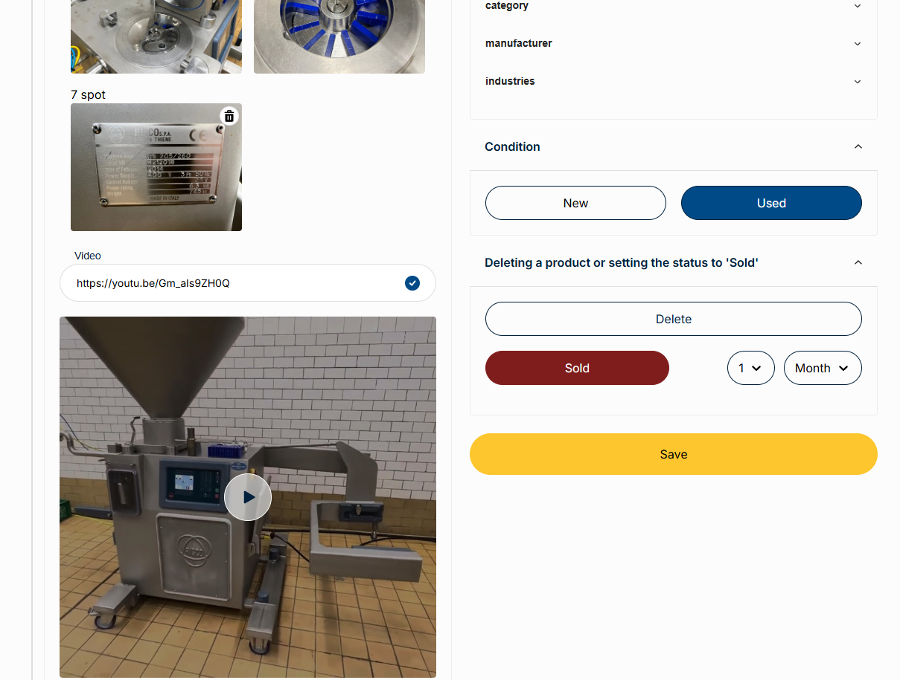
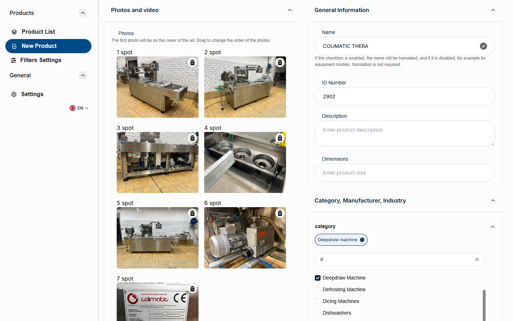
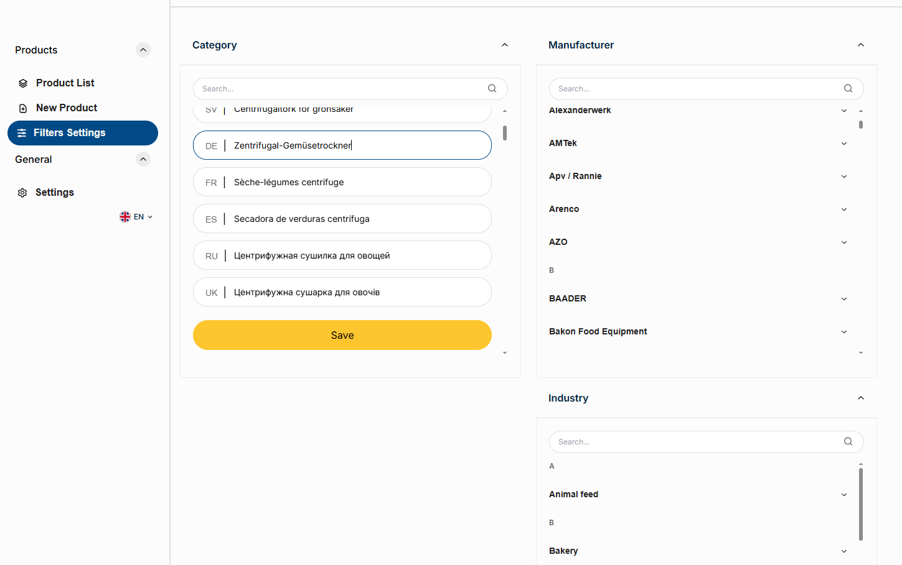

<table>
  <tr>
    <td></td>
    <td><h1>Meat Machines – Industrial Equipment Marketplace & Admin Panel</h1></td>
  </tr>
</table>

## 📦 Project Description

**Meat Machines** is a full-featured web platform for showcasing, managing, and
selling industrial equipment. It includes:

A public-facing website, where users can view available equipment, request
pricing, send messages, or submit items for sale.

An internal admin panel, where authorized staff can manage products, categories,
manufacturers, and industries.

The system is designed for a company engaged in buying and reselling industrial
machinery, with support for media uploads, smart filtering, and multilingual
translations via AI.

---

## 🧱 Project Structure

```
/
├── client/         # Frontend (React admin panel)
├── server/         # Backend (NestJS + MongoDB)
├── README.md       # Project documentation
```

---

## ⚙️ Technologies

**Frontend:**

- React
- TypeScript
- Vite
- Redux Toolkit
- React Router

**Backend:**

- NestJS
- MongoDB (Mongoose)
- JWT Authentication
- Multer (File Upload)
- AI Integration (Automatic Translation)

---

## 🚀 Quick Start

### 📡 Backend

```bash
cd server
npm install
npm run start:dev
```

### 💻 Frontend

```bash
cd client
npm install
npm run dev
```

## 🔧 Key Features

- Browse and filter industrial products

- Request product prices directly via forms

- Contact the company or submit items for sale

- Admin panel with:

  - Create / Edit / Delete Products

  - Manage Industries, Manufacturers, Categories

  - Upload Product Images and Videos

  - Mark products as "Sold" (automatically removed after a time period)

- Product search and sorting

- AI-powered automatic translation system

- Secure access for staff (JWT-based authentication)

---

## 🖼 Admin Panel Screenshots

### ✏️ Edit Product



### ➕ Add Product



### ⚙️ Filters settings



> Screenshots are located in `src/assets/screenshots`

---

## 📝 Notes

- The admin panel is accessible only to authorized staff.

- The system is actively used for managing real product inventory and
  communication.

- Built with flexibility in mind to scale with business growth.

---

## 📬 Contact

Development and support: **Marharyta Katsan**

**Emails:**

- 3margo10@gmail.com
- marharyta.katsan@gmail.com
- info@mmsweden.se
