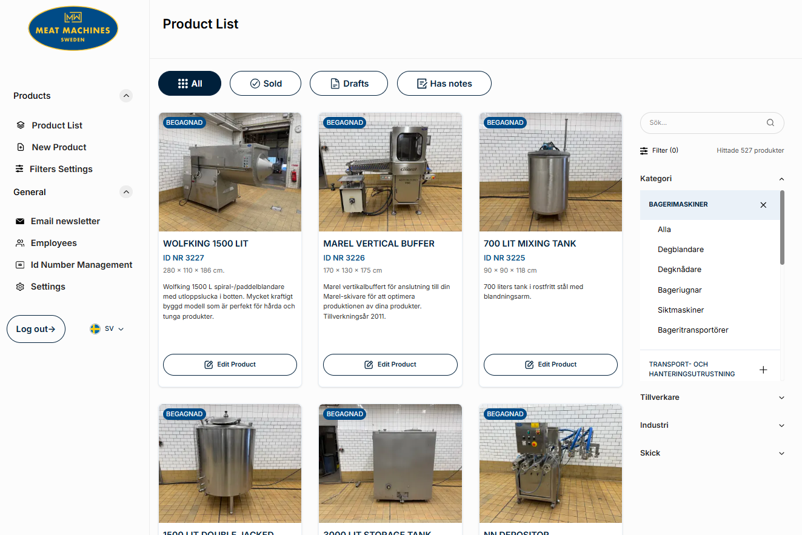
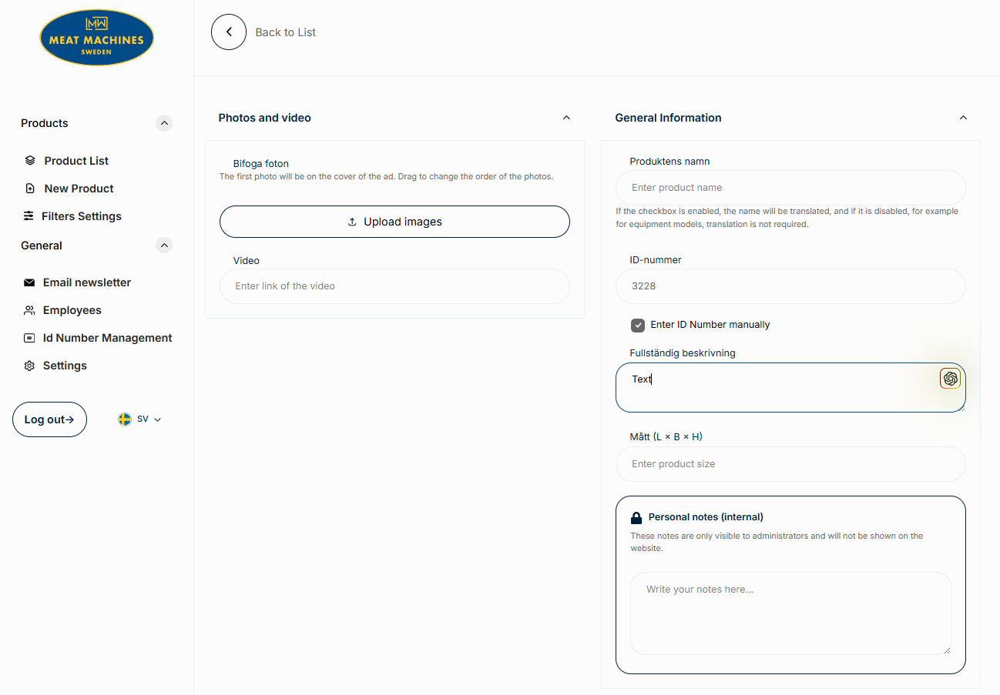
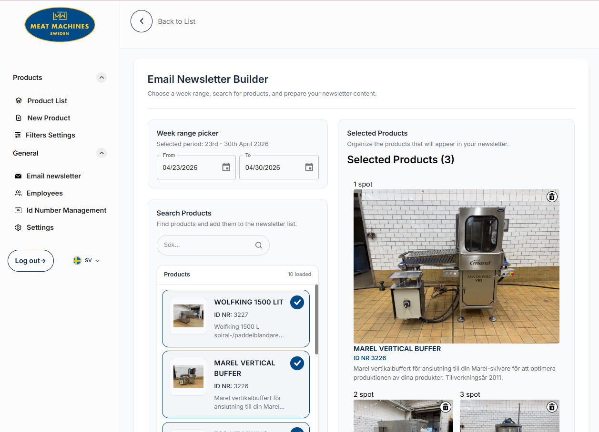

# MMSweden Frontend

A multilingual **Next.js** frontend for **Meat Machines / MMSweden**, built for showcasing used food processing and packaging equipment and for managing catalog content through an internal admin panel.

The repository contains two main parts:

- a **public website** with localized pages, product discovery, inquiry forms, and SEO-oriented routing;
- an **admin panel** for managing products, filters, employees, newsletters, and internal settings.

Live site: **www.mmsweden.se**

---

## Overview

This project is a TypeScript-based web application built with the Next.js App Router. It supports multiple locales, integrates with an external backend API, and includes a protected admin area for day-to-day content operations.

From the repository structure, the app includes:

- a localized public site under `app/[locale]/(site)`;
- a protected admin area under `app/[locale]/admin`;
- service modules for products, categories, counters, employees, auth token handling, and mail requests;
- internationalization via `next-intl` with message files for multiple languages;
- sitemap and robots support for SEO.

---

## Main Features

### Public website

- multilingual routing with locale-prefixed URLs;
- homepage, About Us, All Products, Contact Us, Sell to Us, New Arrivals, My Price Quote, Privacy Policy, and Login pages;
- product catalog browsing with filters, sorting, pagination, and SEO category support;
- contact and inquiry flows connected to backend mail endpoints;
- SEO metadata, robots rules, and sitemap routes.

### Admin panel

- protected admin layout with route gating;
- product management;
- new product creation;
- filter settings management;
- employee settings management;
- email newsletter tools;
- ID / counter settings;
- general settings pages.

---

## Tech Stack

- **Next.js 16**
- **React 18**
- **TypeScript**
- **next-intl**
- **Redux Toolkit**
- **Redux Persist**
- **Axios**
- **Formik + Yup**
- **Tailwind CSS**
- **DaisyUI**
- **Vitest**

Additional UI and utility packages include MUI, Swiper, `react-select`, `react-icons`, drag-and-drop utilities, masking libraries, and other helpers used throughout the public site and admin interface.

---

## Supported Locales

The app currently supports these locales:

- `en`
- `sv`
- `de`
- `fr`
- `es`
- `ru`
- `uk`
- `pl`

The default locale is **English (`en`)**.

---

## Project Structure

```text
.
├── api/                  # Service layer for backend communication
├── app/                  # App Router pages, layouts, sitemaps, robots
│   ├── [locale]/
│   │   ├── (site)/       # Public website pages
│   │   └── admin/        # Protected admin panel pages
├── components/           # Reusable UI and feature components
│   ├── adminDashboard/   # Admin UI modules
│   ├── allProducts/
│   ├── home/
│   └── ...
├── i18n/                 # Locale config, request config, SEO helpers
├── messages/             # Translation files
├── store/                # Redux store and API helpers
├── schemas/              # Validation schemas
├── hooks/                # Custom hooks
├── interfaces/           # Shared interfaces
├── utils/                # Utilities and helpers
└── tests/                # Test-related utilities
```

---

## Public Routes

The public-facing part of the app lives inside `app/[locale]/(site)` and includes pages such as:

- Home
- About Us
- All Products
- Contact Us
- Login
- My Price Quote
- New Arrivals
- Privacy Policy
- Sell to Us

All localized routes are expected to use a locale prefix, for example:

```bash
/en
/en/all-products
/sv/contact-us
/de/sell-to-us
```

---

## Admin Routes

The admin section is located in `app/[locale]/admin`.

Based on the current repository structure, it includes:

- `all-products`
- `new-product`
- `filters-settings`
- `employees-settings`
- `email-newsletter`
- `id-settings`
- `settings`

The admin layout uses protected routing components, so authentication is required to access these pages.

---

## Environment Variables

At minimum, the project expects API and site URL configuration.

Create a `.env.local` file in the project root and add:

```env
API_URL=http://localhost:4000
NEXT_PUBLIC_API_URL=http://localhost:4000
SITE_URL=http://localhost:3000
```

### Notes

- `API_URL` is used on the server side.
- `NEXT_PUBLIC_API_URL` is used in browser-accessible code.
- `SITE_URL` is used for canonical URLs, structured metadata, and sitemap/robots generation.

Adjust the values to match your local backend and frontend URLs.

---

## Getting Started

### 1. Clone the repository

```bash
git clone https://github.com/management-mm/mmsweden.git
cd mmsweden
```

### 2. Install dependencies

```bash
npm install
```

### 3. Add environment variables

Create `.env.local` as shown above.

### 4. Run the development server

```bash
npm run dev
```

Open:

```bash
http://localhost:3000/en
```

---

## Available Scripts

```bash
npm run dev      # Start development server
npm run build    # Build the production app
npm run start    # Start the production server
npm run prod     # Build and start production locally
npm run lint     # Run ESLint
npm run format   # Format the codebase with Prettier
npm run test     # Run Vitest
```

---

## API Integration

The frontend communicates with a backend through service modules in `api/`.

Current services in the repository include:

- `productsService.ts`
- `categoriesService.ts`
- `countersService.ts`
- `employeesService.ts`
- `mailerService.ts`
- `getAuthToken.ts`

These services cover catalog operations, SEO categories, counters/IDs, employee management, admin auth token retrieval, and contact/request form submissions.

---

## SEO

The project includes SEO-focused infrastructure such as:

- page metadata generation;
- locale-aware URLs;
- `robots.ts`;
- sitemap routes including product, category, page, and blog sitemap files.

The robots configuration allows indexing of the public site and blocks `/admin` and `/api`.

---

## Admin Panel Preview

### Dashboard overview



### New product form



### Email newsletter management




---

## Development Notes

- The public site and admin panel live in the same codebase.
- Localization is powered by `next-intl` and JSON message files.
- Remote images are configured for external sources such as Cloudinary and flag CDN.
- The admin area relies on client-side persisted auth state for protected access.

---

## Repository Status

This repository is the frontend application for MMSweden / Meat Machines and is actively structured around multilingual catalog management and admin content operations.

---

## License

This project is private/internal unless you explicitly choose to publish it under a separate license.

---

## Contact

If you have any questions about this project, feel free to reach out:

- **Email:** [marharyta.katsan@gmail.com](mailto:marharyta.katsan@gmail.com)
